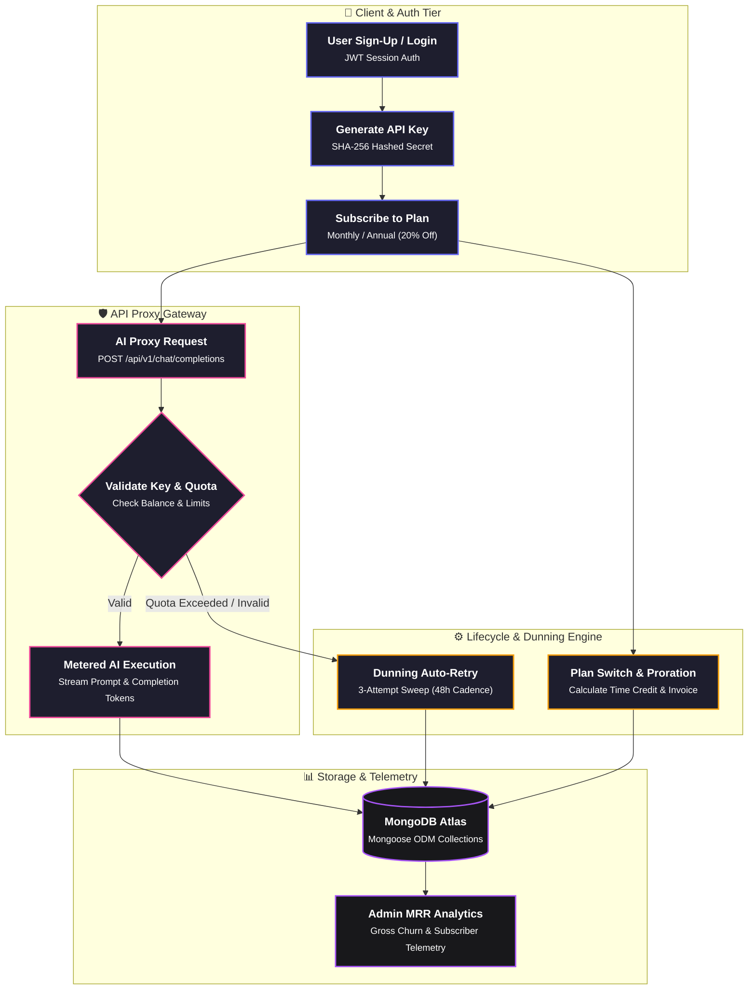
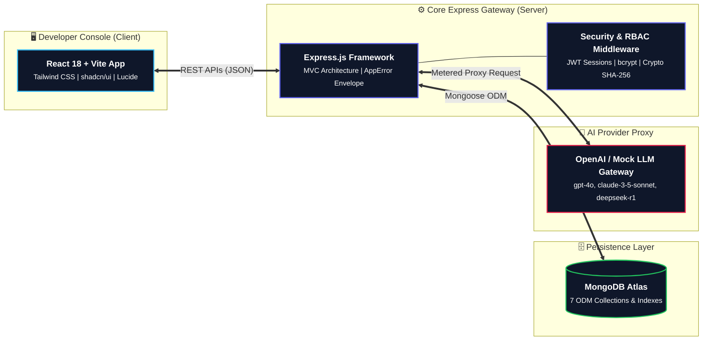
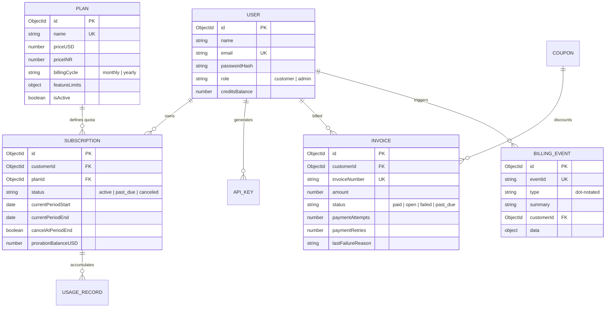
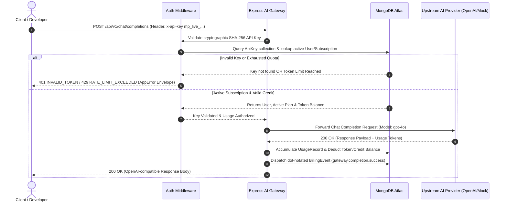

# MeterPrompt — Enterprise SaaS Billing, Metered Usage & AI Gateway Platform


> **Domain:** SaaS / Billing / AI Reverse Proxy Infrastructure  
> **Course:** Advanced JavaScript Backend Frameworks (Node.js & Express.js)  
> **Institution:** 5th Semester, Department of Computer Science, Christ University

---

## 🎓 Mandatory Team Details Page (CIA-3 Submission)

*This project is submitted in full compliance with the CIA-3 Team Project guidelines established by L&T EduTech and Christ University.*

| S.No | Student Name | Roll No. | Department | Section | Assigned Sprint Ownership |
| :--- | :--- | :--- | :--- | :--- | :--- |
| **1** | **Puli Balaji Yashwanth Reddy** | `2462128` | Computer Science | 5 BCD | **Sprint 1 — Foundation:** User Auth, JWT, RBAC Middleware, Plan Management CRUD |
| **2** | **Rhea Tess Payyapilly** | `2462137` | Computer Science | 5 BCD | **Sprint 2 — Core Workflow:** Subscription Creation, Mid-Cycle Proration, AI Token Gateway Proxy |
| **3** | **Prajwal V L** | `2462181` | Computer Science | 5 BCD | **Sprint 3 — Reporting & Polish:** Dunning Engine, Coupon System, MRR Analytics, Postman & README |
| **4** | **Rebecca Lenin Koshy** | `2462134` | Computer Science | 5 BCD | **QA & UI Integration:** Error Boundary, Custom Failure Screens, PDF Receipt Engine |

---

## 💼 Executive Business Overview & Problem Statement

Modern B2B SaaS platforms and AI infrastructure providers require sophisticated billing engines capable of handling multi-tier subscriptions, dynamic annual discounts, mid-cycle upgrades/downgrades with proration credit accounting, overage token metering, coupon caps, and automated dunning workflows. 

**MeterPrompt** addresses this business demand by combining an **OpenRouter-style AI reverse proxy gateway** (`/api/v1/chat/completions`) with an enterprise-grade **Stripe-style billing & metering engine**. It provides a unified gateway for top-tier LLMs (`gpt-4o`, `claude-3-5-sonnet`, `deepseek-r1`, `gpt-4o-mini`), calculates prompt/completion token consumption in real time, enforces monthly quotas, and manages account credit balances seamlessly.

### 🔄 End-to-End User Journey & Architecture Pipeline



1. **Authentication & Key Issuance:** A developer registers and generates a secret API key (`mp_live_...`), stored securely via SHA-256 hashing.
2. **Subscription Checkout:** The customer subscribes to a tier (Starter, Pro, Max) on either a Monthly or Annual basis (20% discount applied to annual lump sums).
3. **API Gateway Execution:** The customer sends OpenAI-compatible requests through `/api/v1/chat/completions`. The gateway authenticates the key, verifies token quotas, routes the request to the LLM provider, and logs token usage.
4. **Mid-Cycle Plan Switches:** Upgrading or downgrading between tiers automatically calculates proration credit for unused time on the previous plan and generates a detailed line-item invoice.
5. **Dunning & Failure Sweep:** Failed renewal attempts trigger a 3-attempt retry schedule (48-hour cadence) before marking the account `past_due` or `suspended`.
6. **Executive Telemetry:** Billing Admins monitor real-time MRR, gross churn percentage, subscriber counts per tier, and a dot-notated event bus stream.

---

## 🛠️ Architecture & Technical Stack



- **Backend:** Node.js, Express.js (MVC modular architecture, Express-Validator, Helmet, CORS).
- **Database:** MongoDB Atlas via Mongoose ODM (deliberate indexing and reference vs. embedding decisions).
- **Security & Auth:** JSON Web Tokens (JWT), Bcrypt password hashing, Crypto SHA-256 for key signatures, strict RBAC middleware.
- **Frontend App:** React 18, Vite, Tailwind CSS, Lucide React icons, Canvas Confetti, Client-Side PDF Generator.
- **API Testing:** Postman Test Suite (`postman_collection.json`) with automated test assertions for all 13 modules.

---

## 📋 13 Functional Modules Implementation Matrix

| # | Syllabus Module | Functional Scope & Features | Controller / Route Handler | Status |
| :---: | :--- | :--- | :--- | :---: |
| **1** | **User Registration & Authentication** | JWT-based sessions, bcrypt password hashing (min 6 chars), role assignment (`customer` vs `admin`). | `authController.js`<br>`/api/auth/register`, `/login` | ✅ Completed |
| **2** | **Subscription Plan Management** | Admin CRUD endpoints to configure price (USD/INR), billing cycle, token quotas, and rate limits. | `planController.js`<br>`/api/plans` (GET, POST, PUT, DELETE) | ✅ Completed |
| **3** | **Subscription Creation Workflow** | Customer checkout flow establishing billing cycle (`monthly` / `annual`) and issuing initial invoice. | `subscriptionController.js`<br>`POST /api/subscriptions` | ✅ Completed |
| **4** | **Plan Switch & Proration Logic** | Mid-cycle tier switches calculating unused time credit and billing annualized lump sums cleanly. | `subscriptionController.js`<br>`PUT /api/subscriptions/:id/change-plan` | ✅ Completed |
| **5** | **Usage Metering Records** | Reverse proxy AI gateway (`/api/v1/chat/completions`) metering prompt and completion tokens. | `gatewayController.js`<br>`/api/v1/chat/completions` | ✅ Completed |
| **6** | **Invoice Generation Engine** | Periodic cycle invoice generator creating itemized records for subscriptions and balance top-ups. | `billingRoutes.js`<br>`POST /api/invoices/generate` | ✅ Completed |
| **7** | **Payment Status Tracking** | Payment mode recording, decline logging, attempt counters (`paymentAttempts`), and failure reasons. | `billingRoutes.js`<br>`PUT /api/invoices/:id/pay` | ✅ Completed |
| **8** | **Subscription Cancellation Engine** | Schedule cancellation at period end (`cancelAtPeriodEnd: true`), preserving proxy access during grace window. | `subscriptionController.js`<br>`PUT /api/subscriptions/:id/cancel` | ✅ Completed |
| **9** | **Promotional Coupon Engine** | Mint percentage-off promo codes with expiration dates (`validTill`) and maximum redemption caps. | `couponController.js`<br>`POST /api/coupons/apply`, `/api/admin/coupons` | ✅ Completed |
| **10** | **Customer Billing Dashboard** | Developer Portal displaying balance top-ups ($10 min), invoice table, receipt modal, and PDF downloader. | `Credits.jsx`<br>`GET /api/billing/history` | ✅ Completed |
| **11** | **Dunning Auto-Retry Workflow** | Automated 3-attempt retry sweep for failed invoices, setting accounts `past_due`/`suspended` after threshold. | `adminBillingRoutes.js`<br>`POST /api/billing/retry-failed` | ✅ Completed |
| **12** | **Admin Revenue Analytics** | Platform-wide financial reporting computing MRR, active paying subscribers, gross churn %, and tier breakdown. | `adminReportRoutes.js`<br>`GET /api/admin/reports/revenue` | ✅ Completed |
| **13** | **RBAC Guard & Error Envelope** | Strict `requireRole('admin')` guard returning HTTP 403 `FORBIDDEN_ROLE_ACCESS` and centralized AppError envelope. | `auth.js`<br>`errorHandler.js` | ✅ Completed |

---

## 🗄️ MongoDB Schema & Data Relationships (ER Design)

### Entity-Relationship Architecture Diagram



### Schema & Indexing Justifications

1. **`User` Collection:** Stores user credentials and balance. Indexed on `{ email: 1 }` (unique) to ensure sub-millisecond login lookups.
2. **`Plan` Collection:** Defines subscription quotas. Indexed on `{ name: 1 }` (unique). Feature limits (`maxRequestsPerMinute`, `maxTokensPerMonth`, `allowedModels`) are embedded as sub-documents since they are always fetched with the plan.
3. **`Subscription` Collection:** Linked to `User` and `Plan` via ObjectIds. Indexed on `{ customerId: 1 }`. Audit trail logs are embedded to keep mid-cycle transition history atomic.
4. **`Invoice` Collection:** Captures payment status. Indexed on `{ customerId: 1, createdAt: -1 }` for rapid history rendering.
5. **`Coupon` Collection:** Discount codes. Indexed on `{ code: 1 }` (unique, uppercase).
6. **`BillingEvent` Collection:** Immutable event bus log. Indexed on `{ customerId: 1 }` and `{ type: 1 }`.

---

## ⚡ End-to-End Auth & Metered AI Proxy Sequence



---

## 📡 Comprehensive REST API Reference Table

| Method | Endpoint Path | Access Guard | Description |
| :---: | :--- | :---: | :--- |
| `POST` | `/api/auth/register` | Public | Register customer or billing admin account |
| `POST` | `/api/auth/login` | Public | Authenticate user and receive JWT session token |
| `GET` | `/api/auth/me` | Authenticated | Retrieve current user profile and credit balance |
| `POST` | `/api/keys` | Authenticated | Generate new cryptographic API key (`mp_live_...`) |
| `DELETE` | `/api/keys/:keyId` | Authenticated | Revoke an existing API secret key |
| `GET` | `/api/plans` | Public / Admin | Fetch active subscription plan catalog |
| `POST` | `/api/plans` | Admin | Create a new subscription plan tier |
| `PUT` | `/api/plans/:id` | Admin | Update pricing, quotas, or status of plan tier |
| `DELETE` | `/api/plans/:id` | Admin | Deactivate a plan tier |
| `POST` | `/api/subscriptions` | Customer | Subscribe to a plan tier (`monthly` or `annual`) |
| `GET` | `/api/subscriptions/me` | Customer | Fetch user's active subscription details |
| `PUT` | `/api/subscriptions/:id/change-plan` | Customer / Admin | Upgrade/downgrade plan with proration adjustment |
| `PUT` | `/api/subscriptions/:id/cancel` | Customer / Admin | Schedule subscription cancellation at period end |
| `POST` | `/api/v1/chat/completions` | API Key Guard | Metered AI reverse proxy gateway execution |
| `POST` | `/api/billing/top-up` | Customer | Top up account credit balance ($10.00 minimum) |
| `GET` | `/api/billing/history` | Customer | Fetch invoice and payment history |
| `POST` | `/api/invoices/generate` | Customer / Admin | Generate periodic cycle invoice settlement |
| `PUT` | `/api/invoices/:id/pay` | Customer / Admin | Record invoice payment status or decline reason |
| `POST` | `/api/coupons/apply` | Authenticated | Apply discount code to subscription |
| `GET` | `/api/admin/coupons` | Admin | List all promotional coupon codes |
| `POST` | `/api/admin/coupons` | Admin | Mint new promotional coupon code |
| `PATCH` | `/api/admin/coupons/:id/toggle` | Admin | Toggle coupon code active status |
| `POST` | `/api/billing/retry-failed` | Admin | Execute dunning auto-retry sweep for failed payments |
| `GET` | `/api/admin/reports/revenue` | Admin | Compute MRR, active subscribers, and gross churn |
| `GET` | `/api/admin/users` | Admin | User Directory & individual profile inspector |
| `GET` | `/api/admin/events` | Admin | Stream dot-notated billing events & diff inspector |

---

## 🛡️ Standardized Error Response Envelope

MeterPrompt implements a strict centralized error handler (`server/middleware/errorHandler.js`) backed by the custom `AppError` class (`server/utils/AppError.js`). Every error response adheres to a uniform JSON envelope:

```json
{
  "success": false,
  "message": "Human-readable error description",
  "errorCode": "STANDARD_SNAKE_CASE_CODE"
}
```

<details>
<summary>🔍 Click to view Sample Error Responses (400, 401, 403, 404, 429)</summary>

#### 1. Input Validation Failure (HTTP 400)
```json
{
  "success": false,
  "message": "Valid email is required; Password must be at least 6 characters long",
  "errorCode": "INPUT_VALIDATION_FAILED"
}
```

#### 2. Authentication Failure (HTTP 401)
```json
{
  "success": false,
  "message": "Invalid authentication token. Please sign in again.",
  "errorCode": "INVALID_TOKEN"
}
```

#### 3. Role-Based Access Control Violation (HTTP 403)
```json
{
  "success": false,
  "message": "Access denied. Requires 'admin' role.",
  "errorCode": "FORBIDDEN_ROLE_ACCESS"
}
```

#### 4. Route Not Found (HTTP 404)
```json
{
  "success": false,
  "message": "The requested endpoint '/api/non-existent' does not exist on this gateway.",
  "errorCode": "ENDPOINT_NOT_FOUND"
}
```

#### 5. Token Quota Exhausted (HTTP 429)
```json
{
  "success": false,
  "message": "Your current billing tier has depleted all monthly inference tokens.",
  "errorCode": "QUOTA_EXHAUSTED"
}
```
</details>

---

## 🚀 Local Setup & Installation Guide

### Prerequisites
- **Node.js**: v18.0.0 or higher
- **MongoDB**: Local MongoDB instance or MongoDB Atlas Cluster URI
- **Git**: Installed on local system

---

### 1. Clone & Environment Setup

```bash
# Clone the repository
git clone https://github.com/YashwanthReddyPuli/MeterPrompt.git
cd MeterPrompt

# Configure Server Environment
cd server
npm install
cp .env.example .env
```

Ensure `server/.env` contains valid credentials:
```env
PORT=5000
NODE_ENV=development
MONGO_URI=mongodb+srv://<USER>:<PASSWORD>@cluster0.kdmhznz.mongodb.net/meterprompt?retryWrites=true&w=majority
JWT_SECRET=super_secret_jwt_key_meterprompt_2026
JWT_EXPIRES_IN=7d
AI_PROXY_MODE=mock
```

---

### 2. Configure Client Environment

```bash
cd ../client
npm install
```

---

### 3. Launch Development Servers

**Run Server (Port 5000):**
```bash
cd ../server
npm start
```

**Run Client (Port 3000):**
```bash
cd ../client
npm run dev
```

---

### 4. Automated Postman Test Suite Execution

A complete, pre-configured Postman test suite containing **20+ automated assertions** is included in the project root (`postman_collection.json`).

1. Open **Postman**.
2. Click **Import** and select `postman_collection.json`.
3. Set the collection variable `baseUrl` to `http://localhost:5000`.
4. Click **Run Collection** to execute all automated test scenarios (Auth, Plan CRUD, Proration, Dunning, MRR Analytics, and RBAC Guards).

---

## 📄 License

Distributed under the **MIT License**. Developed for Continuous Internal Assessment - 3 (CIA-3) under L&T EduTech and Christ University.
